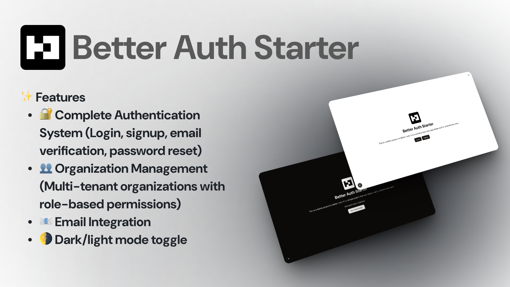

# Better Auth Starter



A modern, full-stack authentication starter template built with Next.js 15, Better Auth, and a powerful tech stack for rapid development.

## ✨ Features

- 🔐 **Complete Authentication System** - Login, signup, email verification, password reset
- 👥 **Organization Management** - Multi-tenant organizations with role-based permissions
- 🎨 **Modern UI** - Beautiful components with Shadcn/ui and Tailwind CSS
- 🗃️ **Type-Safe Database** - Drizzle ORM with PostgreSQL
- 📧 **Email Integration** - Transactional emails with Resend
- 🌙 **Dark Mode** - Built-in theme switching
- 🔒 **Security First** - Built on Better Auth with enterprise-grade security
- 📱 **Responsive Design** - Mobile-first approach
- 🚀 **Performance** - Next.js 15 with Turbopack for fast development

## 🛠️ Tech Stack

- **Framework**: Next.js 15 with App Router
- **Authentication**: Better Auth
- **Database**: PostgreSQL with Drizzle ORM
- **Styling**: Tailwind CSS + Shadcn/ui
- **Email**: Resend
- **Deployment**: Vercel-ready
- **Package Manager**: pnpm

## 🚀 Quick Start

### Prerequisites

- Node.js 18+
- pnpm (recommended) or npm/yarn
- PostgreSQL database (Neon, Supabase, or local)

### Installation

1. **Clone the repository**

   ```bash
   git clone https://github.com/ItisSubham/Better-Auth-Starter
   cd Better-Auth-Starter
   ```

2. **Install dependencies**

   ```bash
   pnpm install
   ```

3. **Set up environment variables**

   Copy the example environment file:

   ```bash
   cp env.example .env
   ```

   Fill in your environment variables:

   ```env
   # Better Auth Configuration
   BETTER_AUTH_SECRET="your-better-auth-secret-here"
   BETTER_AUTH_URL="http://localhost:3000"

   # Database
   DATABASE_URL="your-postgresql-connection-string"

   # Google OAuth (Optional)
   GOOGLE_CLIENT_ID="your-google-client-id"
   GOOGLE_CLIENT_SECRET="your-google-client-secret"

   # Email Service (Resend)
   RESEND_API_KEY="your-resend-api-key"
   EMAIL_SENDER_NAME="Your App Name"
   EMAIL_SENDER_ADDRESS="noreply@yourdomain.com"

   # App Configuration
   NEXT_PUBLIC_APP_URL="http://localhost:3000"
   ```

4. **Set up the database**

   ```bash
   pnpm db:push
   ```

5. **Start the development server**

   ```bash
   pnpm dev
   ```

   Open [http://localhost:3000](http://localhost:3000) to see your application.

## 📊 Database Commands

- `pnpm db:generate` - Generate migration files from schema changes
- `pnpm db:migrate` - Apply migration files to database
- `pnpm db:push` - Push schema changes directly to database (development)
- `pnpm db:studio` - Open Drizzle Studio to view/edit data

## 🔧 Available Scripts

- `pnpm dev` - Start development server with Turbopack
- `pnpm build` - Build for production
- `pnpm start` - Start production server
- `pnpm lint` - Run ESLint
- `pnpm type-check` - Run TypeScript type checking

## 📁 Project Structure

```
├── app/                    # Next.js App Router
│   ├── api/               # API routes
│   ├── dashboard/         # Protected dashboard pages
│   ├── login/            # Authentication pages
│   └── ...
├── components/            # Reusable UI components
│   ├── forms/            # Form components
│   ├── ui/               # Shadcn/ui components
│   └── emails/           # Email templates
├── db/                   # Database configuration
├── lib/                  # Utility functions and configurations
├── server/              # Server-side functions
└── public/              # Static assets
```

## 🔐 Authentication Features

- **Email/Password Authentication**
- **Google OAuth Integration**
- **Email Verification**
- **Password Reset**
- **Session Management**
- **Organization/Team Management**
- **Role-Based Access Control (RBAC)**

## 🎨 UI Components

Built with Shadcn/ui components including:

- Forms with validation
- Data tables
- Dialogs and modals
- Buttons and inputs
- Theme switching
- Toast notifications

## 📧 Email Templates

Pre-built email templates for:

- Welcome/verification emails
- Password reset
- Organization invitations

## 🚀 Deployment

### Vercel (Recommended)

1. Push your code to GitHub
2. Connect your repository to Vercel
3. Add your environment variables
4. Deploy!

### Other Platforms

The app is compatible with any Node.js hosting platform that supports Next.js.

## 🤝 Contributing

1. Fork the repository
2. Create your feature branch (`git checkout -b feature/amazing-feature`)
3. Commit your changes (`git commit -m 'Add some amazing feature'`)
4. Push to the branch (`git push origin feature/amazing-feature`)
5. Open a Pull Request

## 📝 License

This project is open source and available under the [MIT License](LICENSE).

## 🔗 Resources

- [Better Auth Documentation](https://better-auth.com)
- [Next.js Documentation](https://nextjs.org/docs)
- [Drizzle ORM Documentation](https://orm.drizzle.team)
- [Shadcn/ui Documentation](https://ui.shadcn.com)
- [Tailwind CSS Documentation](https://tailwindcss.com)

## ⭐ Support

If you find this project helpful, please consider giving it a star on GitHub!
